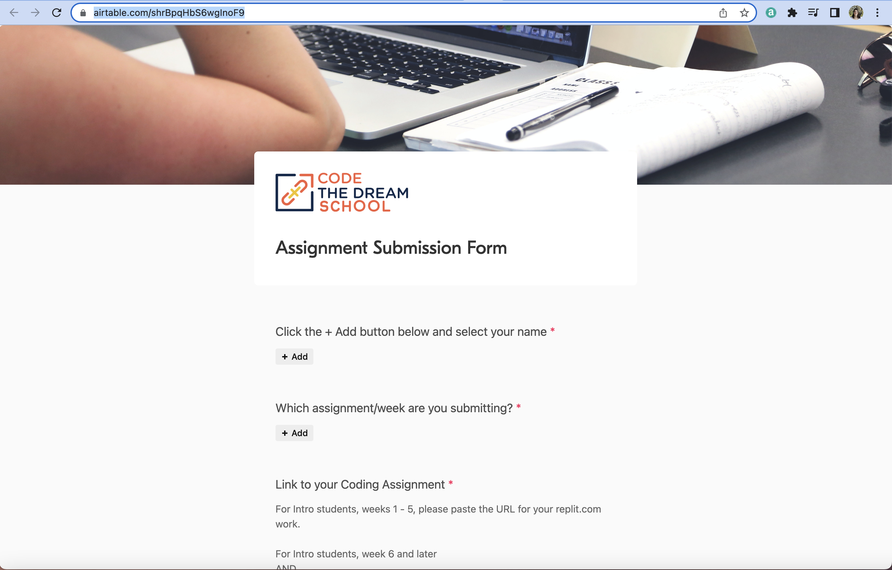

[< Back to Overview](../../README.md)

# How to: Submit an Assignment

## Step 1: Locate the link in Slack or on your lesson page, or use this link: [Assignment Submission Form](https://airtable.com/shrBpqHbS6wgInoF9)

## Step 2: Complete the form
Any questions with a red asterisk * are required.  Be sure to paste the link to your work in the "Link to your coding assignment" question.  Your link should look like 
`https://github.com/yourGitHubUsername/eridanus-intro/pull/#`
where # at the end is the number pull request.  Example: samSmith's very first pull request link would be 
`https://github.com/samSmith/eridanus-intro/pull/1`

## Step 3: Click "Submit" and you're done!
You should receive feedback from your reviewer within a week of submitting.  If you do not receive feedback within a week, let your Cohort Instructional Leader know via Slack message or by emailing [eridanus@codethedream.org](mailto:eridanus@codethedream.org).  Your feedback will be a comment on your pull request.

---

Created by [Code the Dream](https://www.codethedream.org)
